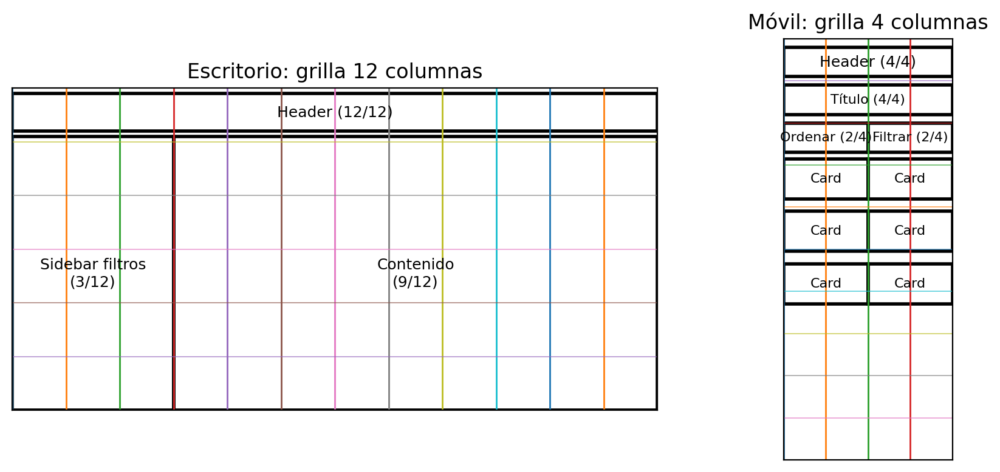
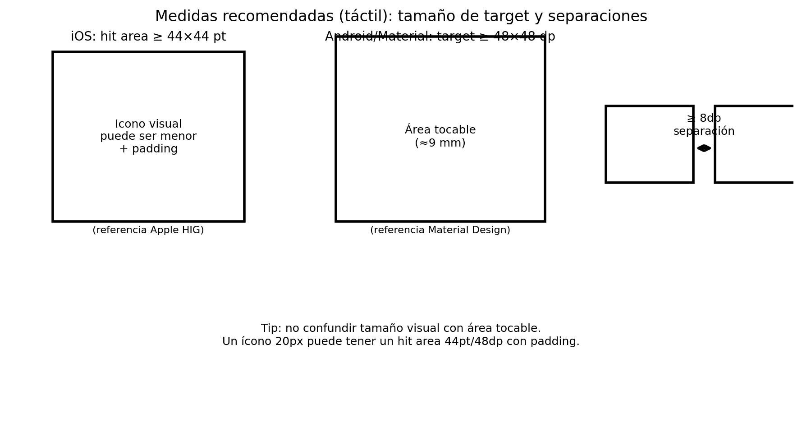
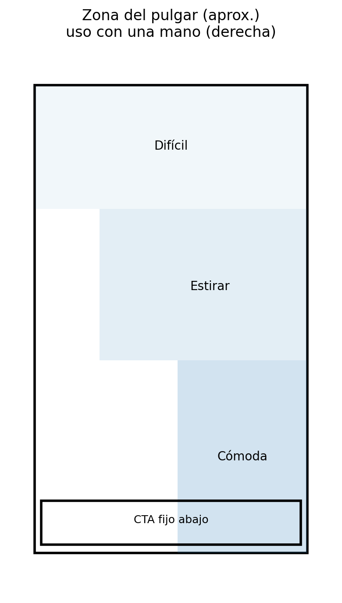
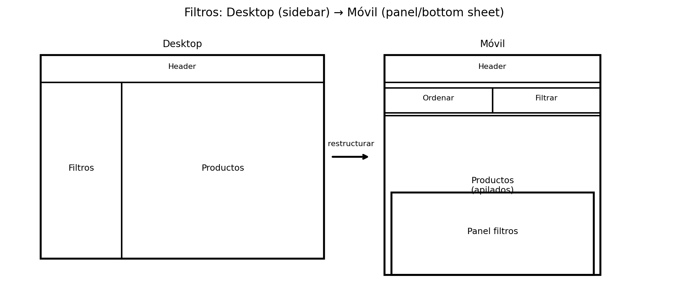
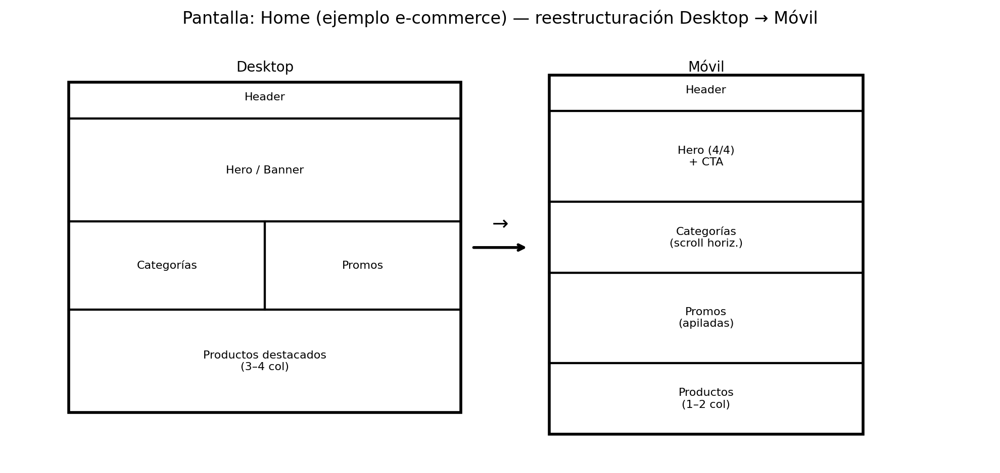
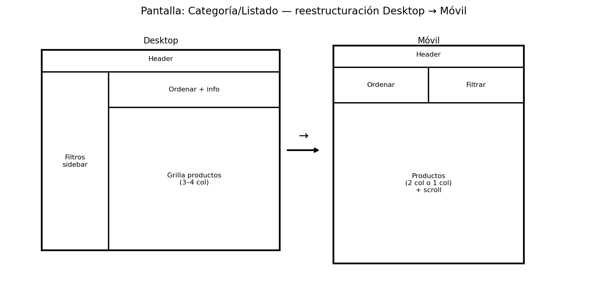
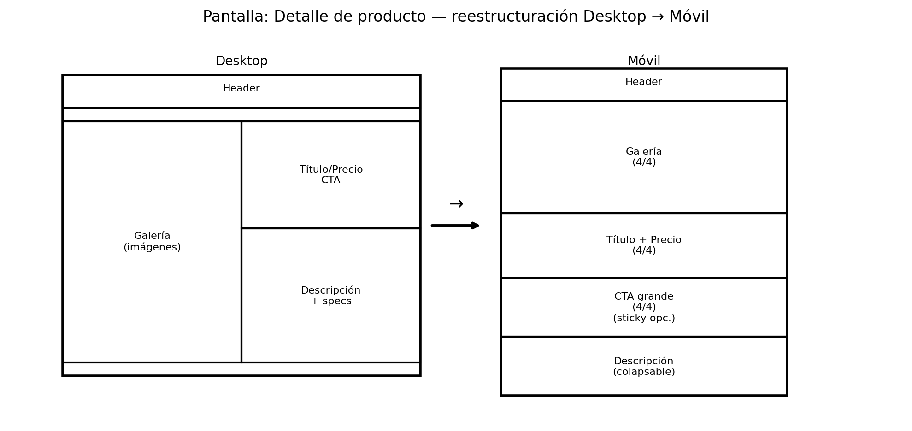
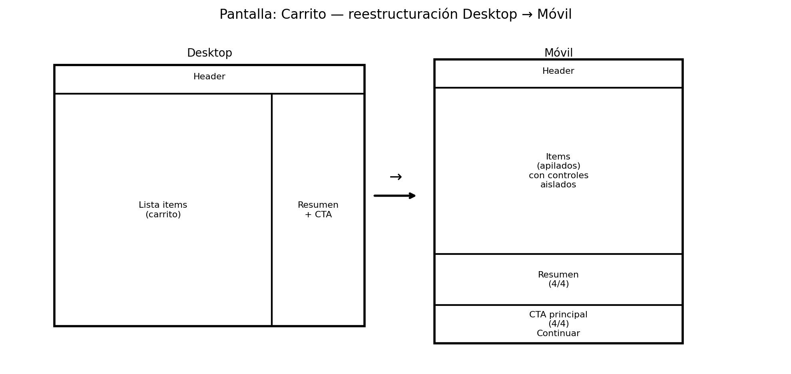

# Exp 3 – Semana 5 (Diseño de Interfaz)
## Reestructurando los mockups de escritorio a móviles (Versión 2)

Esta versión incluye:
- Explicación extensa (con ejemplos e-commerce).
- Apartado de **medidas recomendadas** (tamaño de targets táctiles y separaciones).
- Sección **pantalla por pantalla** (Home / Categoría / Detalle / Carrito) con diagramas “antes → después”.
- Imágenes insertadas localmente para que funcionen en GitHub (`./assets/...`).

---

## Índice
1. [Qué significa reestructurar de escritorio a móvil](#1-qué-significa-reestructurar-de-escritorio-a-móvil)
2. [RA1 e IL2–IL9 aplicados al diseño](#2-ra1-e-il2il9-aplicados-al-diseño)
3. [Principios clave: móvil no es “reducir”](#3-principios-clave-móvil-no-es-reducir)
4. [Ley de Fitts aplicada con ejemplos](#4-ley-de-fitts-aplicada-con-ejemplos)
5. [Medidas recomendadas: targets y separaciones](#5-medidas-recomendadas-targets-y-separaciones)
6. [Responsive Design explicado desde mockups](#6-responsive-design-explicado-desde-mockups)
7. [Grilla móvil de 4 columnas](#7-grilla-móvil-de-4-columnas)
8. [Patrones típicos (filtros sidebar → panel)](#8-patrones-típicos-filtros-sidebar--panel)
9. [Ejemplos pantalla por pantalla (antes → después)](#9-ejemplos-pantalla-por-pantalla-antes--después)
10. [Actividad formativa: guía paso a paso (wireframes móviles)](#10-actividad-formativa-guía-paso-a-paso-wireframes-móviles)
11. [Checklist de calidad](#11-checklist-de-calidad)
12. [Referencias](#12-referencias)

---

## 1) Qué significa reestructurar de escritorio a móvil

**Reestructurar** no es “achicar proporcionalmente” el mockup de escritorio.

En móvil cambian simultáneamente:
- **Espacio**: menos área visible, más scroll.
- **Interacción**: dedo (menos precisión) vs cursor (más precisión).
- **Contexto**: uso en movimiento, una mano, interrupciones.

✅ La meta es mantener **los mismos objetivos del sitio**, pero con un layout y patrones de navegación **apropiados para móvil**.

---

## 2) RA1 e IL2–IL9 aplicados al diseño

### RA1
Identificar técnicas de distribución de contenidos considerando **jerarquía de información**, conectando arquitectura con diseño de interfaz.

En simple: **lo importante se ve primero, se entiende rápido y se toca fácil**.

### IL2 – Estructura visual
Ejemplo (Categoría):
1) Título / contexto  
2) Acciones rápidas: **Ordenar** y **Filtrar**  
3) Listado de productos  
4) Elementos secundarios

### IL3 – Grilla constructiva
Desktop suele usar 12 columnas; móvil (teléfono) suele usar 4 columnas.

### IL5 – Jerarquía visual
En móvil se refuerza con:
- tamaño del CTA principal,
- contraste,
- separación (espaciado).

### IL6 – Distribución de elementos
Desktop = paralelo, Móvil = secuencial (scroll).  
Menú largo → hamburguesa / barra inferior.

### IL7 + IL8 – Guía de estilos y coherencia
Se mantiene identidad (paleta, tipografías, componentes), pero se ajusta:
- tamaños,
- padding,
- patrones (sidebar → panel, etc.).

### IL9 – Reestructuración de layout
Decidir qué:
- se **apila**,
- se **colapsa**,
- se **transforma** (por ejemplo filtros → panel).

---

## 3) Principios clave: móvil no es “reducir”

En móvil normalmente debes:
- **apilar** módulos (de fila a columna),
- **colapsar** navegación (menú → hamburguesa),
- **convertir sidebars** (filtros → panel),
- **simplificar cards** (mostrar lo esencial),
- **fortalecer el CTA principal**.

---

## 4) Ley de Fitts aplicada con ejemplos

La Ley de Fitts indica que la facilidad de seleccionar un objetivo depende de:
- **distancia** al objetivo,
- **tamaño** del objetivo.

Más lejos + más pequeño = más difícil (más errores).

Ejemplos típicos:
- Carrito muy pequeño arriba → difícil con una mano.
- Botones peligrosos juntos (Comprar/Eliminar) → toques accidentales.
- Links de texto pequeños → mala “tappability”.

---

## 5) Medidas recomendadas: targets y separaciones

Este apartado te sirve como “regla de chequeo” antes de cerrar los mockups móviles.

### 5.1 Tamaño mínimo de área tocable (hit area)
- **iOS (Apple HIG)**: área tocable recomendada **≥ 44×44 pt**.
- **Material Design / Android**: touch targets recomendados **≥ 48×48 dp**.

📌 Importante: **tamaño visual ≠ tamaño tocable**  
Un ícono puede verse pequeño, pero tener padding para llegar a 44/48.

### 5.2 Separación entre elementos (para evitar taps accidentales)
- Recomendación práctica (Material/Android): **≈ 8dp o más** entre targets (cuando están cerca).
- Si hay acciones “peligrosas” (eliminar, cancelar), aumenta separación y agrega confirmación.

### 5.3 “Zona del pulgar” (accesibilidad por ubicación)
Acciones frecuentes cerca de la zona cómoda del pulgar.

---

## 6) Responsive Design explicado desde mockups

Responsive Design significa que la interfaz:
- se adapta a distintos tamaños,
- mantiene identidad,
- preserva usabilidad.

En mockups se ve como:
- módulos que se reordenan,
- navegación que se colapsa,
- componentes que cambian de patrón (sidebar → panel).

---

## 7) Grilla móvil de 4 columnas

Regla práctica:
- **4/4**: módulos principales (header, título, CTA, banners).
- **2/4 + 2/4**: acciones pares (Ordenar/Filtrar).
- **2/4**: cards si van 2 por fila.
- **4/4**: cards si van 1 por fila.

---

## 8) Patrones típicos: filtros sidebar → panel

En desktop los filtros suelen estar en un sidebar.
En móvil, se transforman en **panel/bottom sheet**.

Por qué funciona:
- no roba pantalla permanentemente,
- mantiene foco,
- permite un CTA “Aplicar filtros” grande.

---

## 9) Ejemplos pantalla por pantalla (antes → después)

### 9.1 Home

Decisiones típicas:
- categorías como scroll horizontal,
- promos apiladas,
- productos en 1–2 columnas.

### 9.2 Categoría/Listado

Decisiones típicas:
- filtros sidebar → panel,
- “Ordenar” y “Filtrar” como botones 2/4 + 2/4,
- grilla 2 col o lista 1 col.

### 9.3 Detalle de producto

Decisiones típicas:
- galería arriba (4/4),
- CTA grande (idealmente visible sin esfuerzo; sticky opcional),
- descripción colapsable.

### 9.4 Carrito

Decisiones típicas:
- items apilados,
- controles aislados (evitar taps accidentales),
- CTA principal claro.

---

## 10) Actividad formativa: guía paso a paso (wireframes móviles)

1) Elige 2–3 pantallas clave (Home / Categoría / Detalle / Carrito).  
2) Define jerarquía: acción principal + contenido imprescindible.  
3) Reestructura (no reduzcas): sidebar → panel, menú → hamburguesa, módulos apilados.  
4) Aplica grilla 4 columnas.  
5) Revisa medidas: hit areas + separación + zona del pulgar.

---

## 11) Checklist de calidad

- [ ] Mantiene objetivo del sitio (mismo mensaje/propósito).
- [ ] Jerarquía clara: acción principal visible.
- [ ] Navegación simplificada pero encontrable.
- [ ] Targets táctiles adecuados (44pt/48dp como referencia).
- [ ] Separación suficiente entre acciones.
- [ ] Grilla móvil (4 columnas) usada con intención.
- [ ] Transformación correcta de patrones (sidebar → panel).

---

## 12) Referencias
- Apple HIG (Hit targets 44×44 pt): https://developer.apple.com/design/human-interface-guidelines/buttons
- Apple Design Tips (Hit Targets 44×44 pt): https://developer.apple.com/design/tips/
- Material Design (Touch targets 48×48 dp): https://m3.material.io/foundations/designing/structure
- Android Accessibility Help (48×48dp y separación): https://support.google.com/accessibility/android/answer/7101858
- WCAG 2.5.8 Target Size (Minimum) (criterio de accesibilidad): https://www.w3.org/WAI/WCAG22/Understanding/target-size-minimum.html
